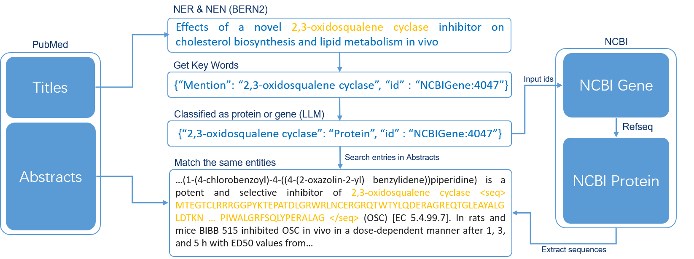

# ProteinLMDataset & ProteinLMBenchmark
**Paper Link:** https://arxiv.org/abs/2406.05540

**Paper Presentation:** Youtube: https://www.youtube.com/watch?v=2EXWnSHyU0U

## ProteinLMDataset SSL Data Generation
### Biology Chinese/English text pair subset
Our data source comprises several Chinese journal websites (e.g., Chinese Journal of Biotechnology, Chinese Journal of Cell Biology), which provide both Chinese and English abstracts of their published articles. We selected journals and articles in the field of protein engineering and extracted these Chinese and English abstracts to form the dataset.
You may attempt to scrape data from other websites as well, but you must first pay attention to their usage agreements.

### PubMed abstracts subset
You can obtain abstracts for PubMed articles through various methods available on their official website: https://pubmed.ncbi.nlm.nih.gov/download/

### PMC full-text manuscripts subset
1. **Preperation:** You can download the original PMC dataset from relevant NCBI websites: https://www.ncbi.nlm.nih.gov/pmc/tools/ftp/ 
2. For the next, you can use code in ```ssl/pmc``` to get the articles that may related to protein knowledges. 
3. For a list of articles highly relevant to protein topics, you can download the corresponding file ```pdb_pubmed.csv``` from the Structure Integration with Function, Taxonomy and Sequence (SIFTS) official FTP server( https://ftp.ebi.ac.uk/pub/databases/msd/sifts/ ). After placing it in the appropriate location, you can execute ```ssl/pmc/highly_pmc_1_pmid_pmcid.py``` to obtain the file pubmed_pmc.csv, which contains all the available PMC IDs.
4. For a list of articles not directly related to protein topics, you can download the corresponding file ```pdb_chain_uniprot.csv``` from the official SIFTS FTP server. After placing it in the appropriate location, execute all the files in the ```ssl/pmc``` folder sequentially according to the numbers following ```week_pmc_```. This process will extract the articles and save them in the ```Data/Literature/articles_json``` folder.  
    Note: You were advised to place the downloaded original PMC data in the ```/Data/paper_text_dataset/pmc``` folder to save time.

### Protein sequence/PubMed abstracts subset
You can generate an embedded text description of the protein sequence dataset step-by-step using the code in ```ssl/seq_in_text```. The complete workflow diagram is as follows:


### UniProt-SwissProt subset
Directly downloading our pre-downloaded and pre-processed original datasets ```proteins1.json``` and ```proteins2.json``` and placing them in the appropriate location, you can directly run the Python files within ```ssl/Uniprot``` to obtain the dataset.


## ProteinLMDataset SFT Data Generation
### UniProt-SwissProt multi project subset
Directly downloading our pre-downloaded and pre-processed original datasets ```proteins1.json``` and ```proteins2.json``` and placing them in the appropriate location, you can directly run the Python files within ```sft/uniprot_1_insert_in_template.py``` to obtain this subset.

### Enzyme Chain of Thought(ECoT) subset
1. **Preperation:** Please visit the Enzyme Nomenclature website of the Nomenclature Committee of the International Union of Biochemistry and Molecular Biology (NC-IUBMB) at https://iubmb.qmul.ac.uk/enzyme/index.html. Locate the **"List of Recommended Names for Enzymes"** section, download all links in the **"separate"** column of the table, and store them in the ```Data/EC_file``` folder.
2. Run the files beginning with ```ECoT``` in numerical order. Finally, you will obtain the ```Enzyme_CoT.json``` file, which should be saved in the ```Data/SFT``` folder.

## ProteinLMBenchmark Part
### Benchmark Generation:
**Preperation:** Before starting, refer to the methods mentioned in the vLLM official documentation (https://github.com/vllm-project/vllm) to wrap the local large model in the OpenAI format interface, making it easier to integrate into the LangChain process. At each stage, we will use the model **'Mixtral-8x7b-Instruct-v0.1'**.

Please execute all files beginning with ```benchmark_{%d}``` in numerical order. During execution, pay attention to the required benchmark scale. After generation, our benchmark underwent further manual review by experts in the protein field. You can directly download our benchmark dataset from the link: https://huggingface.co/datasets/tsynbio/ProteinLMBench. 

